# Chapter 14
In this chapter we work with authentication of the user.
1. First we will begin with setting up the UI with the sign in button that changes to 'User1' when clicked and a button to sign out as well. This is done using the Nav elements in bootstrap.
2. Next, we will replace this button with the google sign in. To do this, we will first register the web application in google cloud and generate a client ID and secret key. Next, we use this client ID in the .env files of UI. Then we will add the google link to the template.js to authenticate the user. 
3. Next, we ensure that the credentials are verified at the back-end. We’ll also get the user’s name from the back-end to verify that we use only verified authentication information. We also establish a session for a logged-in user and keep it persistent across browser refreshes.
4. We need to make sure that on a browser refresh, the information about the sign-in would not disappear. For this we use JSON web tokens. This is like cookies that saves user information in the client side. 
5. To make sure the JWT works correct we need to add it even to the sign out button. This ensures browser needs to be cleared and the Google authentication needs to be forgotten.
6. Now that we have set up the authorization we need to ensure that none of the functionality of the application only works upon signing in. So we first disable the create issue functionality by including a method in the auth.js. 
7. Then, we will make UI changes so that only when the user has signed in, the create issue button is enabled. Else, the button itself gets disabled. This is done even to the close and delete button. 
8. Now, we’ll get the application to work in the non-proxy mode by relaxing the CORS options, at the same time maintaining security.
9. Next, we will make sure the server renders and fetch the authentication information and avoid flicker when the pages are refreshed. 
10. Lastly we will shift from using localhost to another domain for UI and API. We will include the url on google cloud. We will also disable CORS to make sure the data gets fetched to the front end.

## This is the screenshot of the output screen.
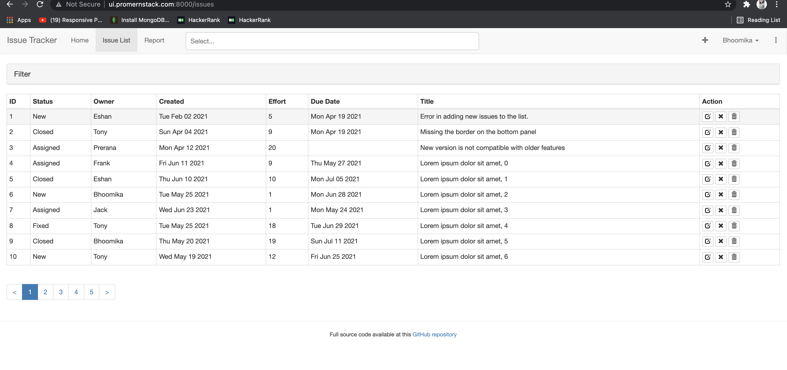

# Chapter 13
In this chapter we add new features and filters to the issue list application. 
1. First we will add higher order components for the toast. The state variables that are used for the Toast: showing state, the message, and the message type. This helps in success and error message displays.
2. Next, we will make use of the aggregate function of mongo. Through a script we will add 100 new issues to the issue list. Once we add issues using the script we will add count issue API. So we add the issue count to the schema and resolvers.
3. Since the report page is incomplete, the Ui for the page is completed by adding a table with the owner name and the count of how many issues they have under their names. 
4. Next, we will build the pagination API. To do this we will first include a new type in the schema. Then. it is added in the issue.js and api_handler.js. Once this is done, the backend can fetch the issues depending on the specified page. 
5. The Ui for pagination is built next. The issue list is edited in such a way that each screen shows 11 issues and the 12th one is added to a new page. The page numbers are made to appear in the bottom left corner and clicking these navigates to different pages in the issue list. 
6. The next API that we will implement is the undo delete API. This is used to restore an issue after deleting it. For this, we will first add the issue restore in the mutation and issue.js. Then we will include it in the resolvers.
7. The UI for undo delete is done in such a way that when the success message is shown after deleting the issue, an undo button is also displayed. This change is done in IssueList.jsx.
8. The next API is to search the keywords and locate the issue that is needed. To do this we will add a new index called text. This is added to the DB through issue.js and init.mongo.js script. The server side is done first and tested in the playground.
9. The search bar is created in the Ui under Search.jsx and this component is nested in the Pages.jsx. Typing in the search box will show the correct match and the needed issues can be clicked.

## This is the screenshot of the output screen.
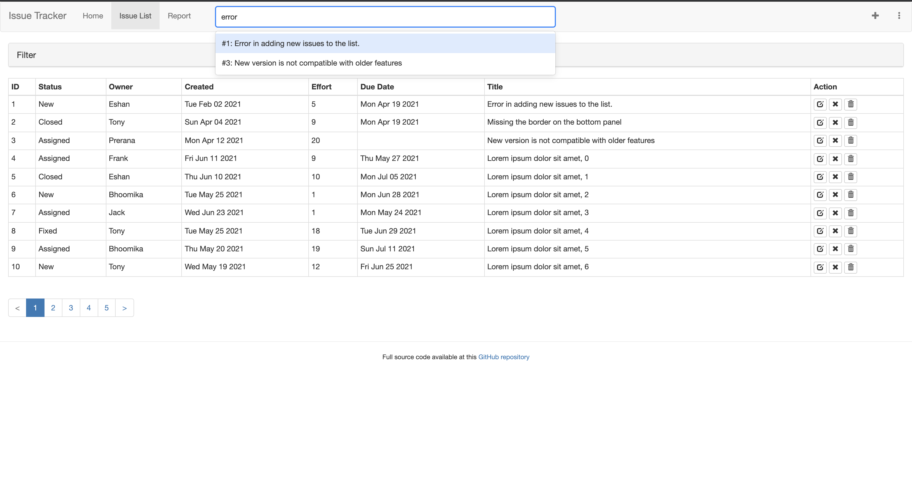

## This is the screenshot of the report screen.
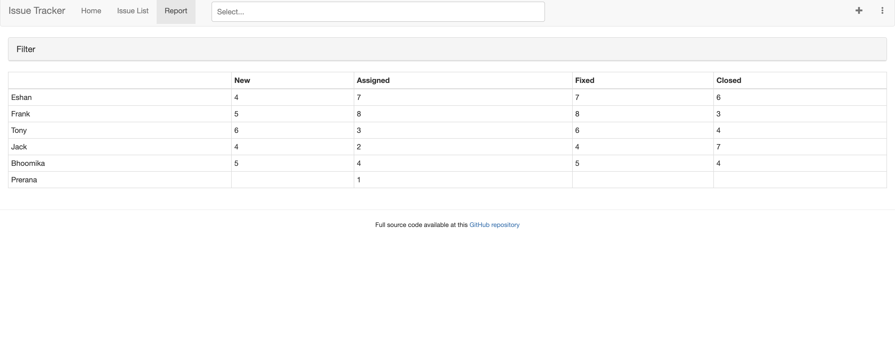

# Chapter 12
In this chapter we will generate HTML from server and render it directly to DOM. 
1. First we will alter the directory structure of UI. Let us create new folders called server and browser. Add the uiserver.js inside server and the App.jsx to browser. Then the .eslintrc files are modified to configure server source files. 
2. Create an About.jsx page in src directory and include this in Contents.jsx and Page.jsx. This file is rendered from the browser. But we want this component to be rendered from the server. So, move this file to the server folder and create a template.jsx file that has the jsx components required to render the file from server. 
3. Now, we just have a simple About component. We’ll need it to get data by calling the about API and rendering it on the server. We will install the required webpack components. Then, make changes in template to render this component from server rather than browser.
4. The drawback of using just webpack is we need to restart the server after making any change. To make sure this is done automatically, HMR is used. We’ll only reload changes to modules based on the shared folder. As for changes to uiserver.js itself, we expect these to be very few,so we restart the server manually when this file is changed and use HMR for the rest of the code that it includes.
5. The navigation bar does not appear on the about page. In order to make this work we will now change the render.jsx to render even the nav bar. 
6. We need to handle event handlers and this is done with a react method called hydrate. Hydrate gives react DOM control over the event. This step completes the server rendering sequence of events.
7. Now, we need to make requests to the API server through graphQLfetch() from the server side. To do this, we will use isomorphic fetch and change uiserver.js and the webpack configurations. Next, we will send requests via graphQlFetch to hit API endpoint. 
8. Next we will have to sync the initial data to the API call. We will pass the same initial data resulting from the API call to the browser in the form of a script and use that to initialize the global store. 
9. Now, we will add a data fetcher in the About component that could be used to populate its message to take care of the case where it is mounted only on the browser. To do this we will initialize a variable in the constructor from the global store, if it has the initial data.
10. Next, we will add routes so that the pages are rendered from these routes rather than index.html. So we will eliminate index.html and add routes.
11. For the browser and server to identify these routes we need to modify IssueEdit, IssueDetail, IssueList and IssueAdd so that their respecitve endpoints are called correctly. Once this is done we will write a query in IssueList to fetch the correct issue details when it is clicked. 
12. Once the issues are clicked the correct description also has to be written for which we will have nest routes within routes. This is done by nesting components and rendering the correct pages for redirecting. 

## This is the screenshot of the output screen.
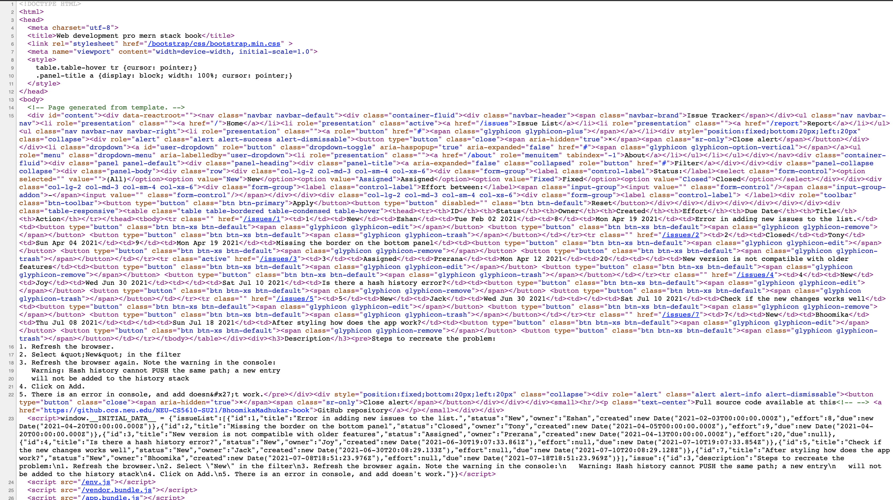

# Chapter 11
In this chapter we added bootstrap styling elements to make the issue list look better. We first install the boostrap using npm.
1. We begin the styling by adding viewport to be responsive on mobiles. Next, we add style to the buttons. The apply button is made blue in color and reset button is changed to match the dimensions of the apply. Next, using icons the delete button and close issue buttons are created. 
2. Next, the nav bar is modified. Using the NavBar components and internal properties like fluid, header etc the navbar is made to look more elegant. 
3. Instead of using hr element to make page sections, panels are used. Panel component is a great way to show sections separately using a border and an optional heading.
4. To style the table Table component is used. Rows and columns are added in the table and on hovering the table background color changes. 
5. To make the filter form more appealing, bootstrap provides many styling elements. Form Group is one such component. Using these the filters are changed and made to a drop down. Here the filter can be selected and applied to the list. 
6. The problem with these forms is that it occupies a wider space which may not work well for smaller screens. To overcome this, rows and column width is added using the bootstrap grid system so that there is not much white spaces and it works well on all screens. 
7. To make the form controls next to one another and labels also to be in the right place, inline forms are used. Here we use it for th owner and title fields. 
8. Another important form element is the edit issue form which requires horizontal form elements. The label appears to the left and each text box are one below another. This is done for the edit issue page and the validation messages are made red for fail and green for success. These messages need to disappear after few seconds and this is achieved via toasts. The toast is implemented in a new jsx file. 
9. Finally, to create a new issue the Modal is used. This is implemented to create a popup and enter the title and owner name to add new issues. A new jsx file called IssueAddNavItem is created to create a + symbol. On clicking this the modal pops up and you can add new issues. 

## This is the screenshot of the output screen.
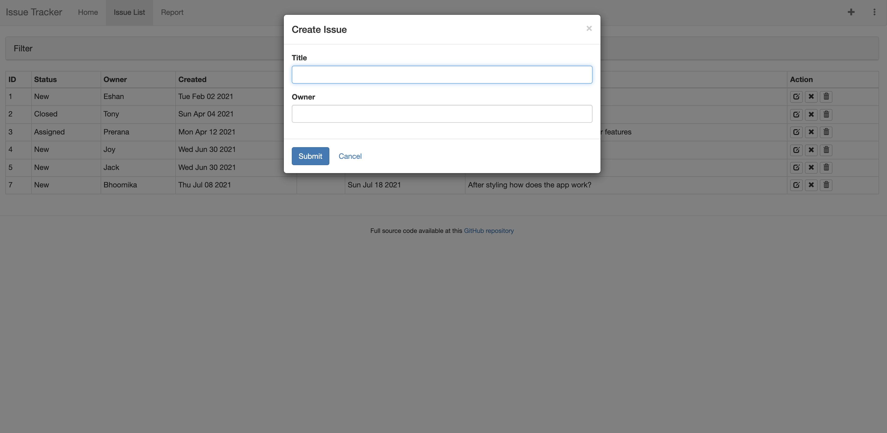

# Chapter 10
In this chapter the CRUD features of react was explored. 
1. First, we created controlled react components. These components are react controlled and work on user input forms. Next, we implement an Apply button to apply the particular filters that can filter out the issue list. 
2. A dropdown is created to show the different status values that are available then clicking the apply button applies the filter and shows the list according to the selected status. A reset button is also implemented so that the filters are reset and the original list is displayed.
3. The schema is changed and two new fields called effortMin and effortMax is added. These fields are added to the UI so that user can enter the range in which the effort needs to be filtered.
4. The next phase is to edit the issues. To be able to edit the issues a complete form is written in the IssueEdit.jsx. A form is written and alink is given next to each issue to edit the issue. Once clicking this edit button the edit page opens which has a submit, next and previous buttons. 
5. When the data is edited, and printed on the console we observer that they are all of string type and not formatted. To do this, we first tackle the number fields. A react component for Number is written so that they are not strings upon editing. 
6. Next, the Date field is updated using the similar method as number to make sure it is not string. The same is done for the text input. 
7. After the editing is done, the next operation is update. After editing we need to be able to see the updated version after refreshing. The first step here is to update the schema to include IssueUpdateInputs that acts as an entry point for the update API. 
8. Next, in the API the update() functions are written and the resolvers are modified to include the updates. 
9. The issue table is updated to make sure that fields get updated and do not change on refresh or reload. 
10. The final operation is the delete operation. The delete api has to make sure the entry in the database is eliminated. So the schema is modified and the remove function is written in the issue.js. 
11. The Ui is then modified to have a button that deletes the issue when clicked. 

## This is the screenshot of the output screen.
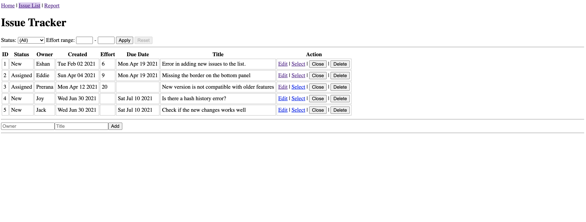

## This is the screenshot of the edit screen.
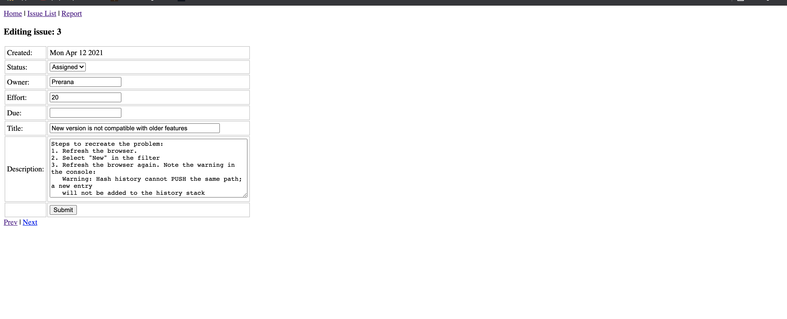

# Chapter 9
In this chapter, newer features were added to the issue tracker app. 
1. First, two views were created. One for the existing issue list and the other for the report page. A router is installed. To achieve routing or switching between different components based on the hyperlink that is clicked, React Router provides a component called Route. New pages were created so that routing could be achieved.
2. Another way of supplying parameters to a component is to use the URL query string. A new component called IssueEdit is added which can be later used to edit the issues. 
3. With the help of query parameters, a new feature called filter is added to the application where the status feature is used to filter the list. Selecting the appropriate status would change the list. 
4. Next, instead of using href, we make use of the react components like Link component. The query string and the hash can be supplied as separate properties to the Link. Href is replaced with the links. 
5. Now, a navbar is created using the links to navigate between the pages. For the active links the background color changes. 
6. A common pattern for displaying details of one object while displaying a list of objects is using the header- detail UI pattern. A description field is added to the issue list and nested routes are created. React Router’s routes don’t all need to be predeclared; they can be placed at any level and are evaluated during the process of rendering. The issuedetail is implemented. 
7. Finally, a browser history is added which helps in organizing different pages and helps in bookmarking and refreshing the pages.

## This is the screenshot of the output screen.
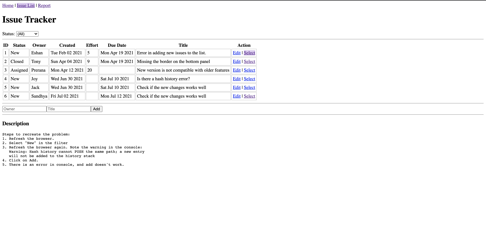

# Chapter 8
In this chapter, the javascript files are split into smaller files so that it is easier for the developers who work together to understand each part of the project clearly. 
1. First, the API files are made into smaller files. The server.js is divided into db.js, issue.js, api_handler.js, about.js and graphql_date.js. Each of these have sections from the server.js itself. Then, they are all imported in the server.js and the app works just as it did before. 
2. Next, the front end is split. A tool called webpack is installed. Webpack automatically determines not just the application’s own dependent modules, but also third-party library dependencies.
3. The code in the App.jsx is segregated into IssueAdd.jsx, IssueTable.jsx, IssueFilter.jsx, IssueList.jsx and graphqlfetch.js. Then with the help of webpack these files are 'watched' and bundled together to make sure everything works as before. 
4. The CDN libraries are also bundled together using Webpack. 
5. A useful feature of webpack is the Hot Module Replacement. This changes modules in the browser while the application is running, removing the need for a refresh altogether. 
6. After HMR is included, the final debugging is done so that the application has no errors while running. 

## This is the screenshot of the output console.
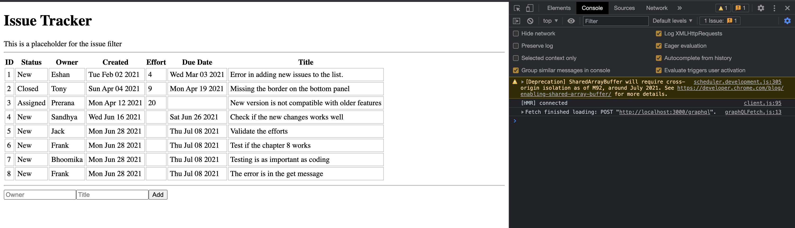

## This is the screenshot of the network tab.
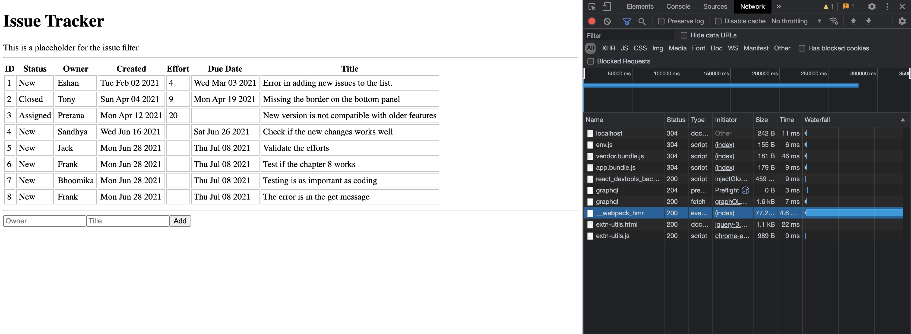

## This is the screenshot of the GET network
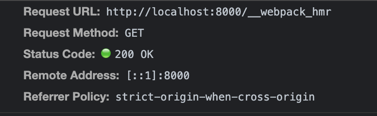

# Chapter 7
In this chapter, the architecture of the project is changed so that it can be more flexible for bigger projects and to separate the API from the UI.
1. The server side of the project that includes graphql and mongodb is added to a folder called API. 
2. The public directory and the src directory is added to another folder called UI.
3. After these changes are made, the package.json is updated in both these folders and the API is made to run at port 8000 and UI at 3000.
4. Next, environment variables are setup by installing dotenv in api and ui directories. Doing this helps us set up mutliple environments for the UI server port and API endpoint to call. 
5. Now, to make sure browsers allow the HTTP requests from multiple environments, a proxy based architecture is set up. 
6. The next important step is to install ESLint in the API and UI folders. This checks for code that can include bugs. It also checks if the code meets the standards that makes the code readable. 
7. Once it is installed and included in package.json, running the lint shows the errors in the code and the places where coding standards have not been met. 
8. The ESLINT is installed for both directories and the required changes are made to make the code readbale. 
9. Finally, the react proptypes are set up so that the type of parameters is always predetermined and specified as part of the function declaration.

## This is the screenshot of running lint on the UI.
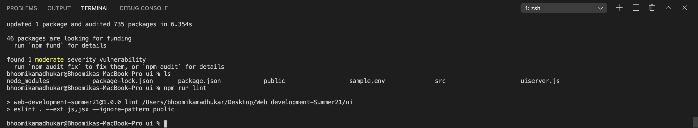

## This is the screenshit of running lint on API.
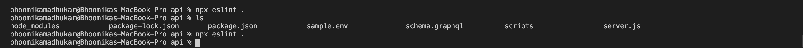

# Chapter 6
In this chapter, a database is setup using mongo db. First, the mongo db is installed and set up in npm.
1. The first step it to understand how the script can be used and create an example database and collections inside that. Mongo DB is used for the CRUD operations and is different from relational databases. 
2. Once the mongo db environment is understood and familiar to use to create, read, update and delete the documents or collections in the database, it is connected to the node.js.
3. The node.js and the mongo shell are connected using a js file called trymongo.js. Once a successful connection is established, the server is changed to accomodate the mongo database to the issue list. 
4. The issueDB is removed from the server.js and added to a new file called init.mongo.js. This database is initialized in the shell and the database connection is established in server.js. Hence the issues displayed in the UI is coming from the Database. 
5. Then, the server is modified so that new issues can be added and saved in the database. The async function is written that updates the id and adds and saves new issues. 
6. Finally, the data that has been added through the UI gets saved in the database and is saved there despite restarts. 

## This is the screenshot of the UI when a new issue is added 
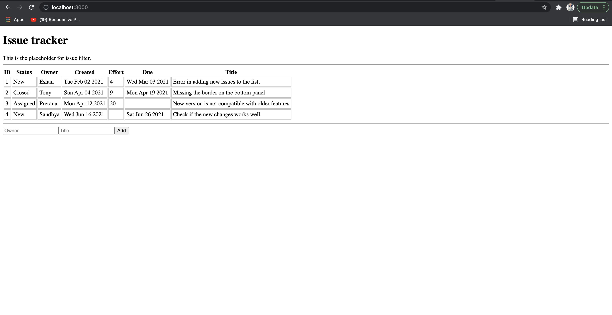

Here is the screenshot of the mongo db when the issue is added:
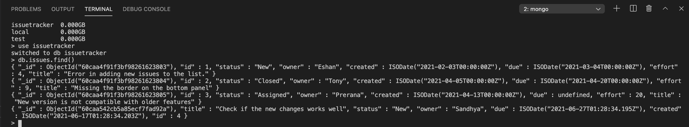

# Chapter 5
In this chapter there was focus on learning about graphql. 
1. Intially, there was a comparison between REST API and Graphql. Then, the graphl was set up using npm. 
2. Next step was building a simple API called the about API. In this API, a string template was used in the server.js and the query and mutation is written to return a simple string. The apollo server was initialized and the query and mutation was handled in the resolvers. Then, when the server was run, the url to access the graphl playground is localhost:3000/graphql. Here the query could be run to check for correctness or any errors. 
3. Instead of writing the schema and the resolver in the same file, another file called schema.graphql was created in the server and this path was added to the package.json. In this file, the schema for the about API is written and the necessary changes to call the schema in the resolver was done in the server.js.
4. The next API that was created was the List API to work with the issue tracker application. For the schema, a schema of type Issue was created with all the properties of the issue tracker application like id, title,owner etc. Then a query was written to fetch these properties from the array. Then in the server.js, to handle this query a resolver was written where there is a function call to a method called issueList. This method returns the issue database elements. 
5. Once the step 4 was complete and the query ran successfully in the playground, this API was integrated in the front end. To do this, in the App.jsx a string template named query was written that contained an object with issueList as the key and the elements in the issueList schema as values. Then a response was created that fetched the data when the HTTP method was POST.
6. The field created and due takes date values which were passed as strings in the schema. Instead of doing that, a custom data type can be created in graphql. using the scalar keyword a custom data type can be created and used. This was done for the data column and was integrated in the front end. 
7. The next API that was created was the Create API. In the create API, new issues can be created in the server. A new input type called issueInput was created and the field were given here. Then the mutation was written to update the list and add new issues to the list. The resolver handled the mutation in server.js using the parseLiteral and the parseValue for going over the data values. 
8. This API was then integrated with the front end using a json response and the new issue is added to the server and displayed on the output screen. 
9. After the create API was integrated, there was a few changes done to the query.Instead of using the string template, query variables are better and more efficient. So the templates are replaced with the query variables. 
10. Finally, the input validations were done for the app. An enum for the status type was created and the input validation is done on the title, status and the errors are sent to the server. It is also integrated with the UI to display to the user. 

## The screenshots for this chapter are shown below
This is the screenshot of the playground and the output of a query is shown.
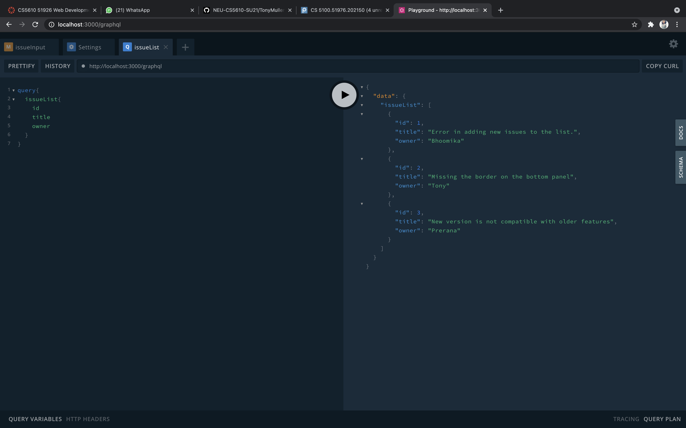

This is the screenshot of the output screen when an error occurs.
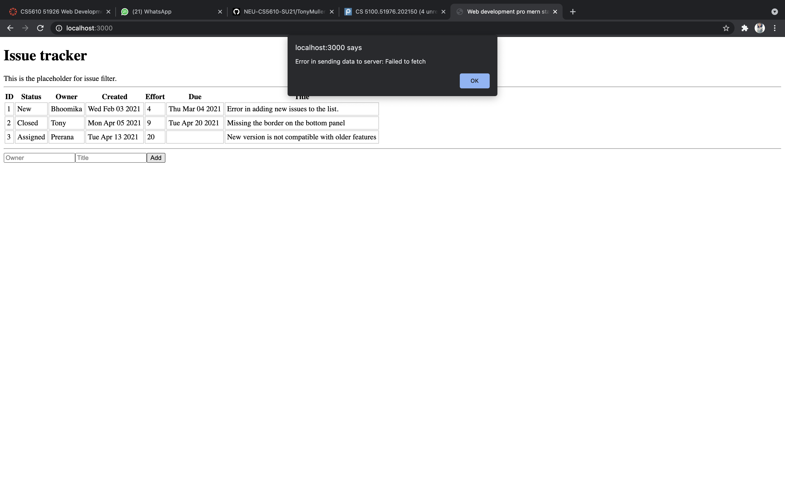

# Chapter 4 
In this chapter the concepts of states were introduced. 
1. Intially, all the issues that were added to the array in chapter 3 are passed as an initial state to the issue table. Then using this.states the issues are called in the issue table and displayed to the screen. 
2. The drawback of using the above approach is that components will not have the initial issues provided statically. A state can only be assigned a value using a constructor. Then with the setState() method, the state can be modified. This is done in the issue table class by setting a time out of 500 seconds. Then the function to load the data from the array is called in a method called componentDidMount(). This process is called asynchronous state initialization. 
3. In the above method, the entire state changed and a completely new value was set to it. Instead of doing this, a better approach would be to change just a part of the state keeping the rest of it unchanged. To update the state this way, a new sample issue was created and was added to the current list of issues by created a copy of the issues using the slice() method. The new issue was added to the copy rather than the original issue list. 
4. Then, the structure of the methods were changed. Instead of having state variables in issue table and issue add, they are moved to the issueList which is the parent class from which other classes can access the state variables. So, all the method bodies were moved to issue List and the children components called and used these methods. 
5. Next, a form was created in order to accept user inputs and add them to the list of issues. To handle these methods the onSubmit method was used and a handleSubmit method was written in order to handle the click of the button. The user can enter the input and it is displayed on the output screen. 
6. Finally, since the issue row and issue table does not make use of states, they are stateless components and are converted into functions that simply contain the jsx code. 

## The output screen after chapter 4:
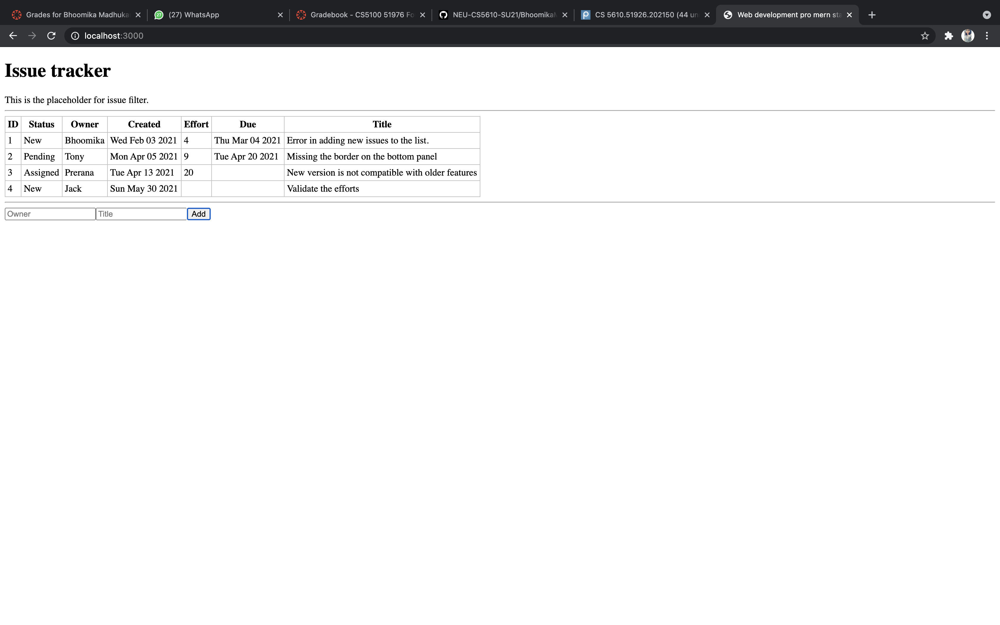

# Chapter 3
In this chapter, the structure for an issue tracking application was created. 

Then, the data was passed between the different react components using three methods:
1. Using the properties of the element to pass the data. This was done using props keyword.
2. Using the children elements to pass data. This was done with props.children and a nested HTML like structure was obtained. 
3. Using dynamic composition of the elements. Here, the data was passed through an array and was rendered with the help of a react component. 

## The final output screen is shown below:
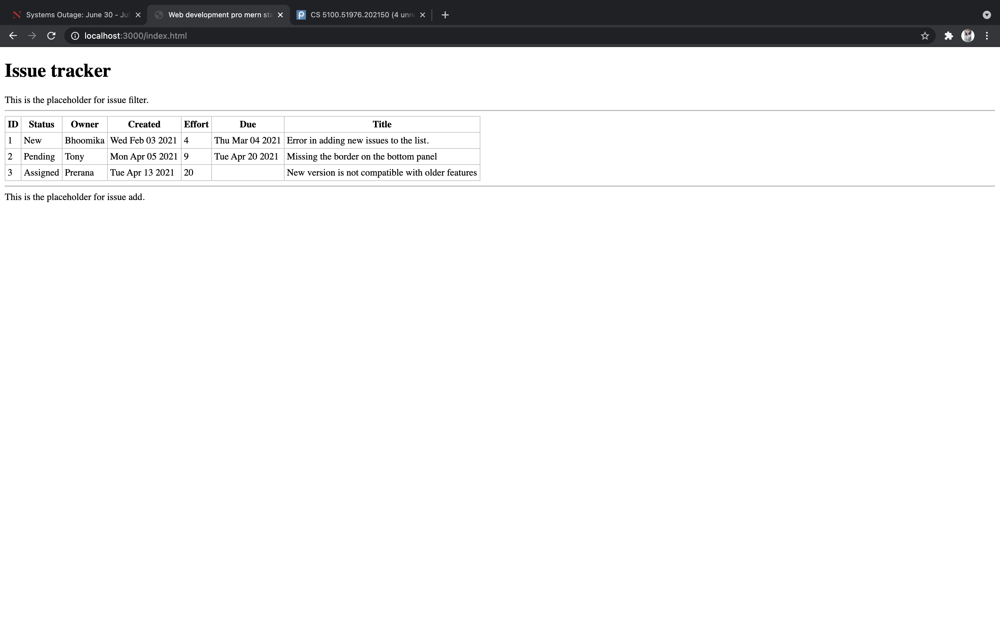

# Chapter 2
In this chapter, first a serverless hello world program is built using html and react elements. The output screen prints 'Hello world!' that is placed between the header html tag. 

Next, jsx elements are introduced and a server is created with the help of express. To do this, first express is installed and setup. Then, a localhost port is given and the localhost starts running. For this to work successfully npm is installed.

Then, the jsx and the html elements are separated out into different files. The jsx files contains the information to be printed to the screen and the html file has a call to the jsx file. Then, the jsx file is separated from the JS file. 

Next, in order to continually update the JS file babel is setup. For all browsers to support the JS syntax, the arrow functions are converted from app.jsx to app.js automatically using nodemon.

## The final screenshot of the working page is given here:
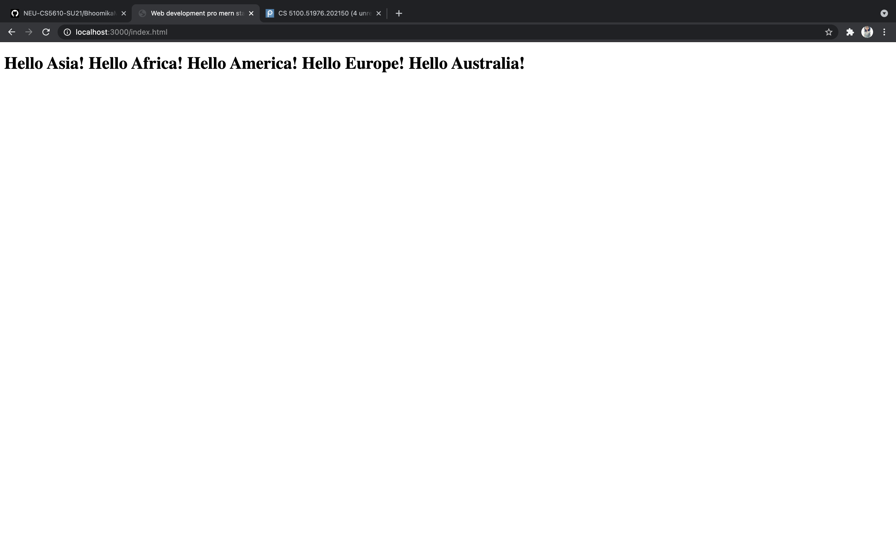

